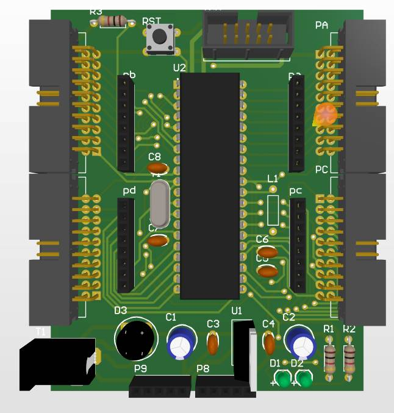
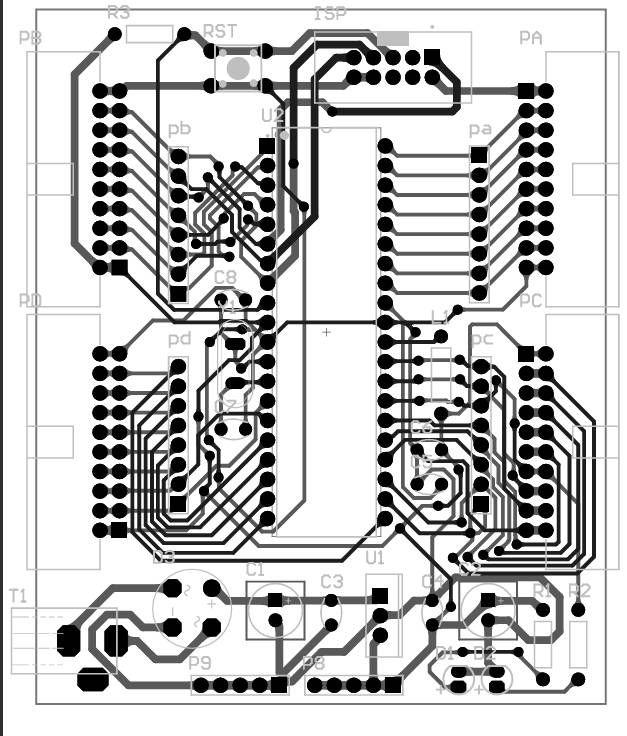
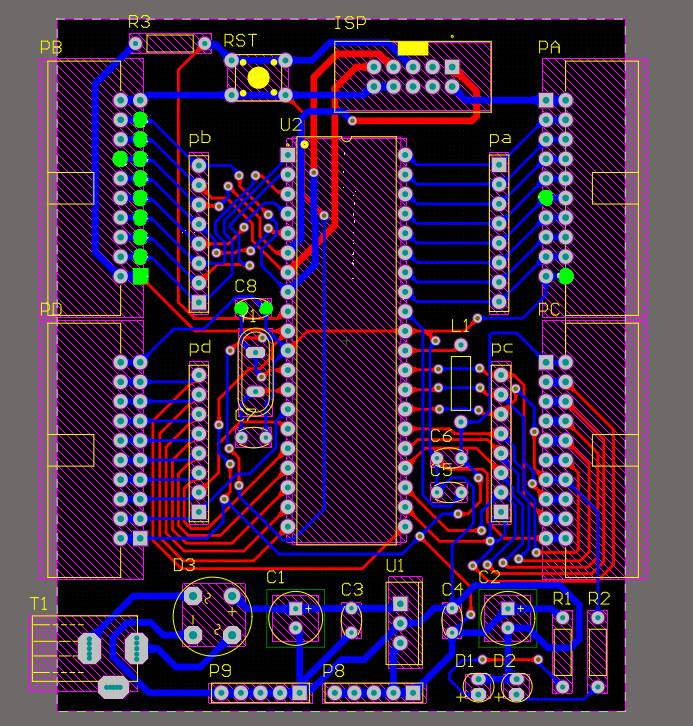

# 🔧 AVR Development Board (ATmega16)

A simple **AVR development board based on the ATmega16 microcontroller**, designed primarily for **experimentation, learning, and prototyping**.

This board was **personally designed for testing and experimental projects**.  
It exposes all major ports of the microcontroller and provides convenient connectors for quick hardware interfacing.

> ⚠️ This is the **first version of the board**.  
> Future revisions may include **improvements, optimizations, and additional features**.

---

# 📸 Board Images

<table>
  <tr>
    <td>
      
    </td>
    <td>
      
    </td>
     <td>
      
    </td>
  </tr>
</table>

---

# ✨ Features

✅ Based on **ATmega16-16PU**  
✅ **16MHz crystal oscillator** for stable operation  
✅ **On-board 7805 voltage regulator**  
✅ **DC barrel jack power input**  
✅ **ISP programming header** for easy flashing  
✅ **LED indicators** for quick debugging  
✅ **All ports (PA, PB, PC, PD)** accessible through headers  
✅ Designed for **quick prototyping and experimentation**

---

# ⚡ Easy Programming

The board includes a **standard AVR ISP header (2×5)**, making it very easy to program the microcontroller using common programmers such as:

- USBasp
- AVRISP
- USBtinyISP
- Arduino as ISP

Simply connect the programmer to the **ISP header** and upload your firmware using tools like:

- **AVRDUDE**
- **Atmel Studio / Microchip Studio**
- **PlatformIO**
- **Arduino IDE (with AVR core)**

---

# 🧩 Bill of Materials (BOM)

| Component | Value / Description | Quantity |
|----------|---------------------|----------|
| Microcontroller | ATmega16-16PU | 1 |
| IDC Connector | IDC BOX 2×10 | 4 |
| IDC Connector | IDC BOX 2×5 (ISP) | 1 |
| Pin Header | Header 1×8 | 4 |
| Pin Header | Header 1×5 | 2 |
| Power Connector | DC Jack | 1 |
| LED | Indicator LED | 2 |
| Resistor | 220Ω | 2 |
| Voltage Regulator | 7805 | 1 |
| Capacitor | 100nF | 4 |
| Capacitor | 100uF | 2 |
| Capacitor | 18pF | 2 |
| Inductor | 100uH | 1 |
| Crystal Oscillator | 16MHz | 1 |
| Button | Reset Button | 1 |

---

# 🧪 Purpose of This Board

This board was created as a **personal experimental platform** to:

- Test AVR projects
- Practice embedded programming
- Quickly prototype hardware ideas
- Interface sensors and modules easily

---

# 🚀 Possible Future Improvements

Since this is **Version 1**, future versions may include:

- Improved power filtering
- USB interface
- On-board programmer
- More compact PCB layout
- Additional debugging features

---

# 📜 License

This project is open-source.  
Feel free to **use, modify, and improve** the design.

---

⭐ If this project helps you, consider giving the repository a star.
